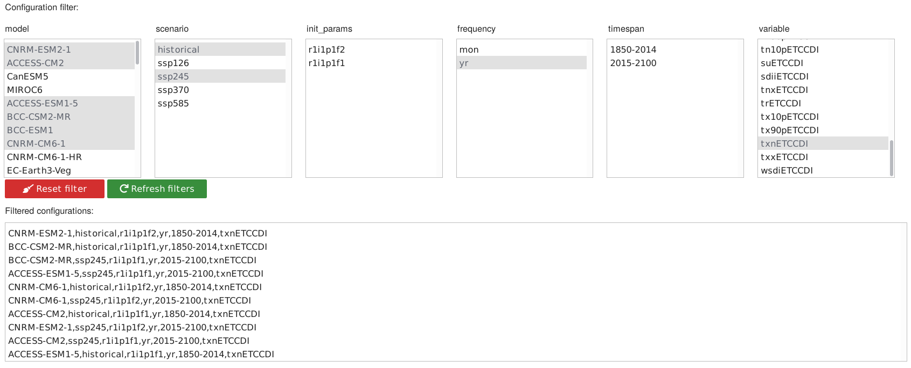
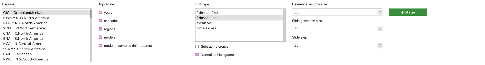
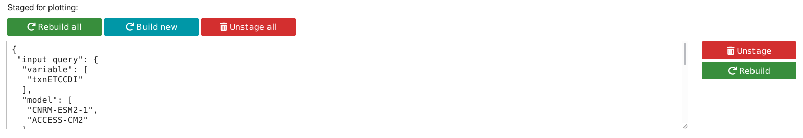
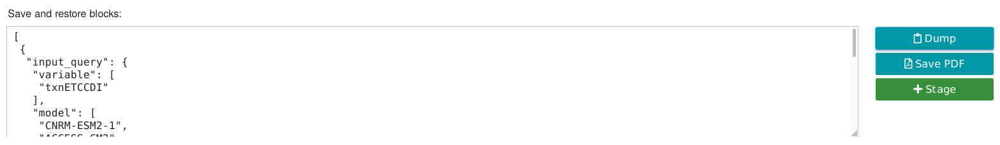

# Visualization of ETCCDI climate indices

## Installation

* Clone repo
* Make sure you have pipenv installed

```bash
git clone https://github.com/vindex10/cicliminds
cd cicliminds
pipenv sync
```

Provide path to the data, and make sure `cicliminds` package is accessible from the notebook. For example like this:

```
DATA_DIR="path/to/data" PYTHONPATH="`pwd`" jupyter lab .
```

This repository is supposed to be a user interface, while all the logic and data processing is handled by Libs:

https://github.com/vindex10/cicliminds-lib

## Usage

The flow of producing the plot consists of several stages:

* *Filter datasets*. Choose model, scenario, ensemble members, variable names
* *Tune properties:*
    - select regions
    - specify whether to aggregate models (scenarios, ensemble members, etc) or build a plot for each of them
    - choose plot type (what will be plotted)
    - tune parameters relevant to the chosen plot type (time window step, width, etc)
* *Stage plots* before building. When aggregations do not reduce datasets to a single plot, several plots
    may be produced. Before actually plotting, one staged block per future plot will appear in the bottom.
* *Fine tune* staged blocks if needed and build! Configuration stored inside the block fully defines the plot.
* If needed, fine tune again and *rebuild* only those that you modified.
* Want to save the work? *Dump the settings* stored in the staged blocks into a text field (copy and store to the file manually).
    Paste and *restore stored setttings* when needed
* *Store plots to PDF*. Path to the file will appear in the text field.
    Experimental functionality, for now only stores the plot on the server. To download it, user must have
    direct access to the server runnin the notebook.

Have a look at the slides to see usage examples: https://github.com/vindex10/cicliminds/blob/master/docs/overview-slides.pdf


### Filter datasets

<p></p>

There are 5 filters that can be applied to choose datasets of interest:

* model
* scenario
* init\_params (ensemble members)
* frequency (monthly or yearly data)
* variable name (specify ETCCDI indexes)

There is one extra field, `timespan` which is inactive but updates according to the filtered datasets.

It is useful to think of logical `OR` in respect to the options within one filter block,
and logical `AND` across the blocks.

When a block is modified all the other blocks update their options accordingly to the current
state of the filters. However, only unmodified before blcoks get updated, so the order of selection matters.

Also the list of filtered datasets is updated each time filter blocks get modified. When nothing is selected in filters,
the filtering behaves the same way as all available fields were selected with the only difference, that "all unselected"
filter box keeps updating according to other filter boxes, when they are modified.


### Tune properties (staging area)

<p></p>

Staging area is the main control panel of the App. Here you specify:

* Regions to focus on. You can select a range with `Shift` or specify several regions with `Ctrl`.
    No regions selected means All regions.
* Specify how to *aggregate datasets*:
    - **years** — stack selected projection scenarios after historical. As a result as many plots
        will be produced as projection scenarios selected, each of them prepended with historical (if selected)
    - **scenarios** — produce one plot with all the scenarios contributed to it. When historical is present,
        it will be prepended ot each of the projections. This option is identical to **years** when only historical and
        one projection was chosen. If both, **scenarios** and **years** are ON, **scenarios** will be used
    - **regions** - all selected regions will be present in one plot. When unchecked, one plot per region will be produced
    - **models** - data points of all selected models will be pulled together. As part of this action, datasets will be 
        downscaled to the coarsed grid among all selected datasets, and time axes will be aligned to each other.
        When unchecked - one plot per model
    - **model ensembles** - `init_params` will be pulled together. May introduce imbalance, if one model has much larger
        set of present ensemble members
* Plot type:
    - **fldmean first** - first do weighted mean over the globe, then produce histogram
        of the variable over the time ranges. (experimental, not yet fully supported)
    - **fldmean last** - first produce histograms of the variable over the time range, for each grid point,
        then do weighted mean over the globe.
    - **mean val** - heatmap of the mean value of the variable. Mean is computed over the last `sliding window size` points
        on time axis. When `subtract reference` is chosen, mean over the reference period will be subtracted.
        To aggregate models and scenarios we apply median.
    - **time series** - plot time dependency of the variable. Before applying model median, curves are smoothed with
        `sliding window size` moving average. Mean value over `reference window size` can be subtracted from each grid
        cell prior to the computation of the fldmean.
* Plot modifiers:
    - **subtract reference** — hide the reference histogram, and subtract it from all the consequent ones
    - **normalize histograms** - when the reference time range differs from the sliding window size, histograms
        will need to be normalized in order to be comparable
* Sliding window parameters (measured in point on the time axis):
    - **reference window size** - initial histogram can be produced on the larger time range than consequent ones
    - **sliding window size** - width of the window that will slide, to produce consequent histograms
    - **slide step** - sliding window shifts by this amount of points along the time axis to produce next histogram

When all the controls are adapted to the needs, click `Stage` to add plot blocks to the panel below.

### Staged area

<p></p>

Here plot blocks appear when staged from the staging area. You can modify datasets and plot parameters
and stage more blocks to this panel independently.

In the text field at the left side of the block you see the configuration that fully defines the plot. You can modify
the config directly in the text field and click `Rebuild` to update the plot.

Click:

* `Rebuild all` to rebuild all blocks
* `Rebuild new` to rebuild only blocks that don't have plots produced (modified blocks won't be rebuilt)
* `Unstage`, `Unstage all` to remove blocks from the staged area

### Save and restore

<p></p>

The contents of the staged blocks completely define the plots produced. To save the work and be able to
reproduce it or come back and continue from where you've left, click `Dump`. Contents of the staged blocks
will appear as a plain text in the text field. Copy and save it somewhere. Next time you wish to restore the state,
paste and click `Stage` in this panel.

Experimental option `Save PDF` stores the PDF containing all the plots on the machine that is running the app.
The path to the stored PDF will be shown in the text field.


## Technical design

The app runs in the jupyter notebook and is based on the jupyter widgets. 
